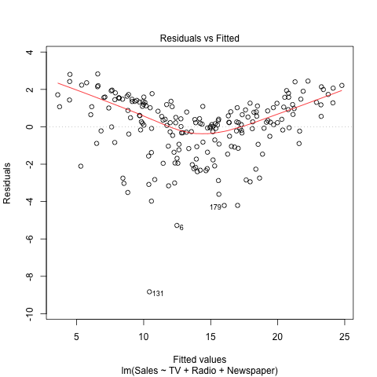
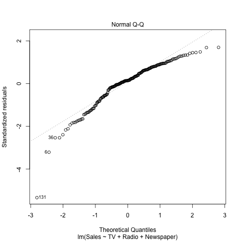

# Abstract
In this report we reproduce the main results displayed in section 3.2 **Multiple Linear Regression** (chapter 3) of the book *An Introduction to Statistical Learning*.


# Introduction
The overall goal of this analysis is to provide advice on how to improve sales of the particular product given the current information. More specifically, the idea is to determine whether there is an association between advertising and sales, and if so, develop an accurate model that can be used to predict sales on the basis of the three media budgets. For this analysis specifically, we consider a combination of simple linear regression and multiple linear regression.
```{r,echo=FALSE}
library(xtable)
options(xtable.comment = FALSE)
options(knitr.comment = FALSE)
load("../data/overallSummary.RData")
load('../data/regression.RData')
load('../data/correlation-matrix.RData')
source('../code/functions/regression-functions.R')
```

# Data
The *Advertising* data set consists of the *Sales* (in thousands of units) of a particular product in 200 different markets, along with advertising budgets (in thousands of dollars) for the product in each of those markets for three different media: *TV*, *Radio*, and *Newspaper*. In this report, we focus on the possible relation between each of them and *Sales*, and the possible relation between *Sales* and the three of them combined.

We may first look at the table of summary statistics below: 

```{r,echo=FALSE, results='asis',message=FALSE}
xtable(overallSummary, caption = "Summary Statistics")
```

The distribution of the variables might not be necessarily clear. We may also have a look at the histograms:

```{r, out.width = "150px", echo=FALSE,message=FALSE, fig.align ='center', eval = T, split=TRUE}
knitr::include_graphics("../images/histogram-tv.png")
```

From the *Histogram of TV* above, see that the frequencies over the range are approximately even, with *200-250* highest and *250-300* lowest. We then inspect the distribution of *Radio*:

```{r,out.width="150px", echo=FALSE, message=FALSE, fig.align='center'}
knitr::include_graphics("../images/histogram-radio.png")
```

From the *Histogram of Radio* above, we can see that an appproximately skewed-to-the-right distribution, with a peak of frequency at 0~5 and gradually descending when the amount increases. Then we have a look at the distribution of *Newspaper*:

```{r,out.width="150px", echo=FALSE, message=FALSE, fig.align='center'}
knitr::include_graphics("../images/histogram-newspaper.png")
```

Similarly to the previous graph, from this *Histogram of Newspaper*, we may soon notice an even clearer skewed-to-the-right distribution, with a peak of frequency at 0~5 and gradually desencding when the amount increases.We then inspect the distribution of *Sales*:

```{r, out.width = "150px", echo=FALSE,message=FALSE, fig.align ='center', eval = T, split=TRUE}
knitr::include_graphics("../images/histogram-sales.png")
```

From the *Histogram of Sales* above, we can see an approximately bell shape distribution, with *10-20* the highest, which we could infer from the summary statistics above. We then explore with the following methodology.


# Methodology
## Single Linear Regression

We may first consider only using one media fromthe data set, *TV*, *Radio* and *Newspaper* respectively, and study its relationship with the dependent variable *Sales*. The null hypothesis here would be that each of the independent variables would not have an effect on *Sales*, and the alternative hypothesis is that they do have an effect on *Sales*. For this purpose, we use a simple linear model:

$$Sales = \beta_{0} + \beta_{1} (TV | Radio | Newspaper)$$

## Multiple Linear Regression

Instead of fitting a separate simple linear regression model for each predictor, a better approach might be to extend the simple linear regression model so that it can directly accommodate multiple predictors. We can do this by giving each predictor a separate slope coefficient in a single model. Given that we have three distinct predictors here, the multiple linear regression model takes the form:

$$Sales = \beta_{0} + \beta_{1}TV + \beta_{2}Radio + \beta_{3}Newspaper$$

We will evaluate both possibilities here.

# Results
## Single Linear Regression
### Regression of *Sales* on *TV*
After fitting the data to a a simple linear regression model, we compute the regression coefficients:
```{r,echo=FALSE,results='asis'}
tvInfo = summary(tvFit)
xtable(tvInfo$coefficients, caption = 'Simple regression of Sales on TV')
```

From the table above we can extract the intercept and slope for future graphing. And we see that the p values for both intercept and *TV* returned by this simple linear regression model are both smaller than 0.05, showing statistical significance. Also, the *Standard error* of the two parameters are significantly smaller than the actual values. Therefore, we may have enough evidence against the null hypothesis that the two factors are not related. *TV* does have an effect of *Sales*.

Furthermore, we can dig deeper into the parameters of the least squares model. The table below shows information about a few important indicators when evaluating a model:

```{r,echo=FALSE, results='asis',message=FALSE}
tvTable = matrix(nrow = 3, ncol = 2)
Quantity = c("RSE", "R2", "F-stat")
tvValue = c(residual_std_error(tvFit), r_squared(tvFit), f_statistic(tvFit))
tvTable[,1] = Quantity
tvTable[,2] = tvValue
colnames(tvTable) = c('Quantity', 'Value')
xtable(tvTable, caption = "Quality Indices of Regression of Sales on TV")
```

We can see that the Residual Standard Errors and R^{2} for this model is relatively small, meaning that the simple linear regression model is a relatively good fit of the data.

And we plot the scattor plot with the fitted regression line:

```{r,echo=FALSE,out.width="200px",message=FALSE,fig.align='center'}

```

As we can see from the scattor plot above, the regression line approxiates most the relation between *TV* and *Sales*.


### Regression of *Sales* on *Radio*
```{r,echo=FALSE,results='asis',message=FALSE,fig.align='center'}
radioInfo = summary(radioFit)
xtable(radioInfo$coefficients, caption = 'Simple regression of Sales on Radio')
```

From the table above we can extract the intercept and slope for future graphing. And we see that the p values for both intercept and *Radio* returned by this simple linear regression model are both smaller than 0.05, showing statistical significance. Also, the *Standard error* of the two parameters are significantly smaller than the actual values. Therefore, we may have enough evidence against the null hypothesis that the two factors are not related. *Radio* does have an effect of *Sales*.

Furthermore, we can dig deeper into the parameters of the least squares model. The table below shows information about a few important indicators when evaluating a model:

```{r,echo=FALSE, results='asis',message=FALSE}
radioTable = matrix(nrow = 3, ncol = 2)
Quantity = c("RSE", "R2", "F-stat")
radioValue = c(residual_std_error(radioFit), r_squared(radioFit), f_statistic(radioFit))
radioTable[,1] = Quantity
radioTable[,2] = radioValue
colnames(radioTable) = c('Quantity', 'Value')
xtable(radioTable, caption = "Quality Indices of Regression of Sales on Radio")
```

We can see that the Residual Standard Errors and R^{2} for this model is relatively small, meaning that the simple linear regression model is a relatively good fit of the data.

And we plot the scattor plot with the fitted regression line:

```{r,echo=FALSE,out.width="200px",message=FALSE,fig.align='center'}

```

As we can see from the scattor plot above, the regression line approxiates most the relation between *Radio* and *Sales*.

### Regression of *Sales* on *Newspaper*
```{r,echo=FALSE,results='asis',message=FALSE,fig.align='center'}
newspaperInfo = summary(newspaperFit)
xtable(newspaperInfo$coefficients, caption = 'Simple regression of Sales on Newspaper')
```

From the table above we can extract the intercept and slope for future graphing. And we see that the p values for both intercept and *Newspaper* returned by this simple linear regression model are both smaller than 0.05, showing statistical significance. Also, the *Standard error* of the two parameters are quite smaller than the actual values. Therefore, we may have enough evidence against the null hypothesis that the two factors are not related. *Newspaper* does have an effect of *Sales*.

Furthermore, we can dig deeper into the parameters of the least squares model. The table below shows information about a few important indicators when evaluating a model:

```{r,echo=FALSE, results='asis', message=FALSE}
newspaperTable = matrix(nrow = 3, ncol = 2)
Quantity = c("RSE", "R2", "F-stat")
newspaperValue = c(residual_std_error(newspaperFit), r_squared(newspaperFit), f_statistic(newspaperFit))
newspaperTable[,1] = Quantity
newspaperTable[,2] = newspaperValue
colnames(newspaperTable) = c('Quantity', 'Value')
xtable(newspaperTable, caption = "Quality Indices of Regression of Sales on Newspaper")
```

We can see that the Residual Standard Errors is comparatively larger than previous predictors', and R^{2} for this model is relatively small, meaning that the simple linear regression model is a not a necessarily good fit of the data.

And we plot the scattor plot with the fitted regression line:

```{r,echo=FALSE,out.width="200px",message=FALSE,fig.align='center'}

```

As we can see from the scattor plot above, the regression line does not really capture the relation between *Newspaper* and *Sales*.

## Multiple Linear Regression
After fitting the data to a a simple linear regression model, we compute the regression coefficients:
```{r,echo=FALSE,results='asis'}
multiInfo = summary(multiFit)
xtable(multiInfo$coefficients, caption = 'Multiple regression of Sales on TV, Radio and Newspaper')
```

From the table above we can extract the intercept and slope for future graphing. And we see that the p values for *intercept*, *TV*, and *Radio* returned by this multiple linear regression model are all smaller than 0.05, showing statistical significance. Also, the *Standard error* of the *intercept*, *TV* and *Radio* are significantly smaller than the actual values. These facts do not apply to *Newspaper*, for tis standard error is larger than its estimate and the p value is not significant. 

To have a better idea about this, we can take a look at the correlations between the predictors:
```{r,echo=FALSE, results='asis'}
xtable(correlationMatrix, caption = 'Correlation matrix for TV, Radio, Newspaper and Sales of the Advertising Data')
```

From the correlation matrix above, firstly we can see that *TV* and *Radio* have relatively low correlation. As predicators, they may contribute to the final predictions in different ways. *TV* and *Newspaper* have relatively low correlation as well. And *TV* and *Sales* have a quite high correlation, meaning that *TV* may be a good indicator of *Sales*.

Secondly, *Radio* and *Newspaper* have a relatively high correlation, meaning that they may contribute to the final predictions in similar ways. *Radio* and *Sales* also have quite high a correlation, meaning that *Radio* may be a good indicator of *Sales*.

Thirdly, *Newspaper* and *Sales* have relatively low correlation, and the amount above 0 might be likely to be due to its corrleation with *Radio*. Therefore, *Newspaper* might not be a good indicator of *Sales.*

We may also have a look at the correlation matrix between these variables:
```{r,echo=FALSE, out.width='200px',fig.align='center'}

```

The graphs show similar observations.

Overall, we may conclude that, the correlations between predictors should be low, and the correlations between predictors and the dependent variables should be high. Therefore, for this analysis specifically, *TV* and *Radio* are two good predictors for *Sales*, not necessarily so for *Newspaper*.

As for the fitness of the model, we can dig deeper into the parameters of the least squares model. The table below shows information about a few important indicators when evaluating a model:

```{r,echo=FALSE, results='asis',message=FALSE}
multiTable = matrix(nrow = 3, ncol = 2)
Quantity = c("RSE", "R2", "F-stat")
multiValue = c(residual_std_error(multiFit), r_squared(multiFit), f_statistic(multiFit))
multiTable[,1] = Quantity
multiTable[,2] = multiValue
colnames(multiTable) = c('Quantity', 'Value')
xtable(multiTable, caption = "Quality Indices of Multiple Linear Regression of Sales on TV, Radio and Newspaper")
```

We can see that the Residual Standard Errors and R^{2} for this model is relatively small, meaning that the simple linear regression model is a relatively good fit of the data.

And we plot the scattor plot with the fitted regression line:

```{r,echo=FALSE,out.width="200px",message=FALSE,fig.align='center'}

```

As we can see from the scattor plot above, the regression line approxiates most the *Sales*, best at the center and worse at the tails.

We may also have a look at the Q-Q plot of the residuals:
```{r,echo=FALSE,out.width="200px",message=FALSE,fig.align='center'}

```

We can see that the residuals do not really follow the normal distribution. The residuals may possibly be skewed left.

# Conclusions
In conclusion, the multiple linear regression does a better job than the single linear regressions. When evaluating predictors for multiple linear regression, we may want the predictors have low correlations between them, but have high correlations with the dependent variables. When evaluating the linear model for the prediction, we may look at Residual Standarnd Error, R^{2} and F-statistic with the given degree of freedom: the closer these statistics to 0, the better the model approximates the data.


